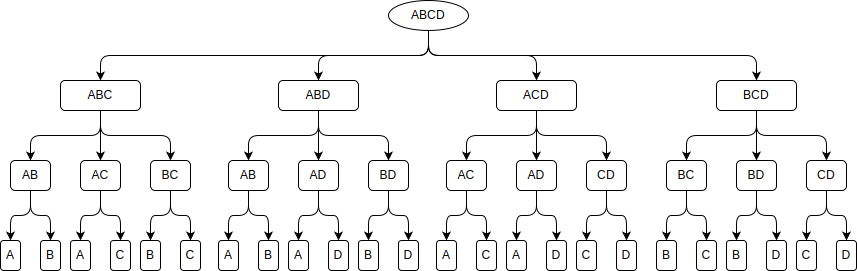
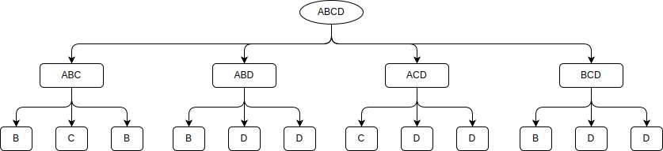
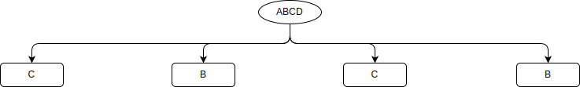

+++
tags = ["algorithm", "backward induction", "game theory", "java", "zermelo's theorem"]
categories = ["Algorithms"]
title = "Finding winning strategies"
date = 2017-05-02T13:15:00+03:00
draft = false
+++

This time I want to show how to _solve a game_ using a perfect play which means being able to predict the outcome of the game from any position. The perfect play is the strategy that leads to the best possible outcome for that player regardless of the response by the opponent. For the illustration I have selected two children’s games with stones. The rules are very simple. There is a pile of 99 stones. Two player take **n** stones out of the pile in turn. The one who takes the last stone is the winner. In each game **n** is different:

1.  it is in the closed interval between 1 and 3
2.  power of 2

Let’s find out how to always win these kind of games.
<!--more-->

## Problem identification
As both games are very similar I will talk about them as a single one. This is a game of two players with only two possible outcomes; either one or the other of the players wins, no draw is possible. So, this is a strictly competitive finite two-person game. As players move in turns and each player at all times is aware of all the events that have previously occurred, this is a game of perfect information. According to Zermelo’s theorem

> Any finite two-person game of perfect information in which the players move alternatingly and in which chance does not affect the decision making process, if the game cannot end in a draw, then one of the two players must have a winning strategy

## The algorithm
Now that we know the type of problem we are dealing with this leads us to the main question of how to analyze the game. The answer is to model the game, which is to build a tree of all possible decisions made by both players over time. This tree is usually called a _game tree_ whose nodes are positions in a game and whose edges are moves. With this tree it is possible to solve the game using backward induction. Backward induction is an extremely powerful technique that has been applied not just to games but also to many other problems in computer science. It is sometimes known as Zermelo’s algorithm, named after Professor Ernst Zermelo, who used it to analyze the game of chess. The idea is very simple: to traverse the game tree in reverse order from leaves (endgame states) to the root (initial state) each time assuming the current move-making player is choosing what is best for himself. Here is a small example. Let’s assume that we are playing a television game show quiz. There is given a set of possible subjects, e.g. { Algebra, Biology, Chemistry, Drama}. Each participant in turn chooses a subject that he doesn’t want to answer and it disappears from the list. For example, there are 3 players with their own preferences (in descending order):
<table>
<thead>
<tr style="height: 24px;">
<th style="height: 24px; text-align: center;">Player 1</th>
<th style="height: 24px; text-align: center;">Player 2</th>
<th style="height: 24px; text-align: center;">Player 3</th>
</tr>
</thead>
<tbody>
<tr style="height: 24px;">
<td style="height: 24px; text-align: center;">A</td>
<td style="height: 24px; text-align: center;">C</td>
<td style="height: 24px; text-align: center;">D</td>
</tr>
<tr style="height: 19px;">
<td style="height: 19px; text-align: center;">B</td>
<td style="height: 19px; text-align: center;">A</td>
<td style="height: 19px; text-align: center;">B</td>
</tr>
<tr style="height: 24px;">
<td style="height: 24px; text-align: center;">C</td>
<td style="height: 24px; text-align: center;">B</td>
<td style="height: 24px; text-align: center;">C</td>
</tr>
<tr style="height: 24px;">
<td style="height: 24px; text-align: center;">D</td>
<td style="height: 24px; text-align: center;">D</td>
<td style="height: 24px; text-align: center;">A</td>
</tr>
</tbody>
</table>

### The straightforward way
First of all lets try to solve the situation in a straightforward manner. So, **Player 1** is getting rid of subject **D**, **Player 2** – **B** (**D** is already removed), **Player 3** – **A**. The result is – **C** (Chemistry), which is not so good for **Player 1**. Now let’s solve it the other way.

### Backward induction

First we need to build a complete game tree. [](./gametree.svg) Then, assuming the fact that **Player 3**, who is making the last choice, always chooses what is best for himself, the tree can be reduced to the following [](./gametree1.svg) The same assumption for **Player 2** [](./gametree2.svg) When the tree is fully reduced we can see that **Player 1** is really choosing only between **B** and **C** and furthermore if he wants to get a better result in the end he has to sacrifice a better option in the beginning.

## Coding
Now back to our problem. Let’s code the backward induction algorithm using java this time. First, we need to store the changing state of the game.
```java
import java.util.ArrayList;
import java.util.List;

public class State {
    private int stoneCount;

    public State(int stoneCount) {
        this.stoneCount = stoneCount;
    }

    public List<State> getNextStates() {
        List<State> result = new ArrayList<>(3);
        result.add(new State(stoneCount - 1));
        result.add(new State(stoneCount - 2));
        result.add(new State(stoneCount - 3));
        return result;
    }

    public int getStoneCount() {
        return stoneCount;
    }

    public boolean isTerminated() {
        return stoneCount <= 3;
    }

    @Override
    public String toString() {
        return String.valueOf(stoneCount);
    }
}
```
Then the game tree. Each node contains the current state, boolean field that shows if the current player is able to win in the current state, and the next state that will come after the chosen move.
```java
public class Node {
    private State state;
    private boolean currentPlayerWins;
    private Node nextNode;

    public Node(State state) {
        this.state = state;
    }

    public State getState() {
        return state;
    }

    public boolean getCurrentPlayerWins() {
        return currentPlayerWins;
    }

    public void setCurrentPlayerWins(boolean currentPlayerWins) {
        this.currentPlayerWins = currentPlayerWins;
    }

    public void setNextNode(Node nextNode) {
        this.nextNode = nextNode;
    }

    @Override
    public String toString() {
        String result = String.format("{%s | %s}", state, currentPlayerWins);

        if (nextNode != null) {
            result += String.format(" -> %s", nextNode);
        }

        return result;
    }
}
```
The last thing that we need is the worker that will build and reduce the game tree. Here we need to do some tricks. First of all don’t try to store the complete tree in memory, because you will need to allocate **56343125079040471808818753** nodes. I bet that you will run out of memory pretty soon. Instead, we might generate only the winning subtrees, because a single winning subnode is enough to treat the previous node as winning. Another thing is that though the amount of nodes is enormous, the amount of possible states is limited to between 1 and 99, and no matter how you get to it either straight from 99 to 96, or following the path 99 -> 98 -> 96, if the current player is able to win from state 96 in the first branch, he wins from this state in the second. So, cache can be used to store results for states that have already been calculated.
```java
import java.util.Collections;
import java.util.HashMap;
import java.util.List;
import java.util.Map;

public class TreeWorker {
    private final Map<Integer, Node> cache = new HashMap<>();

    public Node generateTree(State initialState) {
        Node root = new Node(initialState);
        generateSubTree(root);
        return root;
    }

    private void generateSubTree(Node node) {
        if (node.getState().isTerminated()) {
            node.setCurrentPlayerWins(true);
            return;
        }

        Node nextNode = null;
        List<State> states = node.getState().getNextStates();
        Collections.shuffle(states);
        for (State state : states) {
            nextNode = cache.get(state.getStoneCount());
            if (nextNode == null) {
                nextNode = new Node(state);
                generateSubTree(nextNode);

                cache.put(nextNode.getState().getStoneCount(), nextNode);
            }

            if (!nextNode.getCurrentPlayerWins()) {
                break;
            }
        }

        node.setCurrentPlayerWins(!nextNode.getCurrentPlayerWins());
        node.setNextNode(nextNode);
    }
}
```
For the second game (with powers of 2) we need to slightly modify the `State` class
```java
import java.util.ArrayList;
import java.util.List;

public class State {
    private int stoneCount;

    public State(int stoneCount) {
        this.stoneCount = stoneCount;
    }

    public List<State> getNextStates() {
        List<State> result = new ArrayList<>();
        int cnt = 1;
        while (cnt <= stoneCount) {
            result.add(new State(stoneCount - cnt));
            cnt = cnt << 1;
        }
        return result;
    }

    public int getStoneCount() {
        return stoneCount;
    }

    public boolean isTerminated() {
        int cnt = 1;
        while (cnt < stoneCount) {
            cnt = cnt << 1;
        }

        return cnt == stoneCount;
    }

    @Override
    public String toString() {
        return String.valueOf(stoneCount);
    }
}
```

## The result
Now run the code
```java
TreeWorker worker = new TreeWorker();
Node root = worker.generateTree(new State(99));

System.out.println(root);
```
This will give an output similar to this for the first game: `{99 | true} -> {96 | false} -> {93 | true} -> {92 | false} -> {91 | true} -> {88 | false} -> {85 | true} -> {84 | false} -> {81 | true} -> {80 | false} -> {77 | true} -> {76 | false} -> {75 | true} -> {72 | false} -> {69 | true} -> {68 | false} -> {67 | true} -> {64 | false} -> {63 | true} -> {60 | false} -> {58 | true} -> {56 | false} -> {55 | true} -> {52 | false} -> {51 | true} -> {48 | false} -> {46 | true} -> {44 | false} -> {42 | true} -> {40 | false} -> {37 | true} -> {36 | false} -> {33 | true} -> {32 | false} -> {30 | true} -> {28 | false} -> {25 | true} -> {24 | false} -> {21 | true} -> {20 | false} -> {18 | true} -> {16 | false} -> {13 | true} -> {12 | false} -> {11 | true} -> {8 | false} -> {7 | true} -> {4 | false} -> {3 | true}` So, it seems that the first player has the winning strategy and will win from the initial position if he performs a perfect play. In this case the second player is desperate – having `false` in each of his moves shows the absence of moves leading to a victory. It is not hard to notice the pattern. Each time the second player takes 1 stone out of the pile, the first takes out 3 stones; for 2 stones – 2 stones; and for 3 stones – 1 stone. So the idea is quite clear – to win one has to keep the number of stones divisible by 4. For the second game the output is somewhat similar to the following: `{99 | false} -> {98 | true} -> {66 | false} -> {58 | true} -> {54 | false} -> {46 | true} -> {30 | false} -> {14 | true} -> {6 | false} -> {2 | true}` So, here the situation is totally different and the first player cannot win if both sides perform a perfect play. The strategy is to keep the number of stones divisible by 3.

## Outro
Zermelo’s backward induction algorithm is one of the cornerstone algorithms in game theory. It is a classic example of dynamic programming, in which a solution to an overall problem is systematically built up from the solutions to smaller problems. It can be used to analyze different games from tic-tac-toe to chess. So, try it your own!
